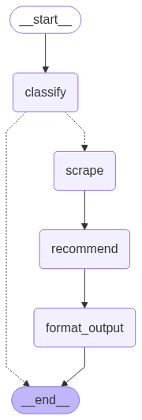
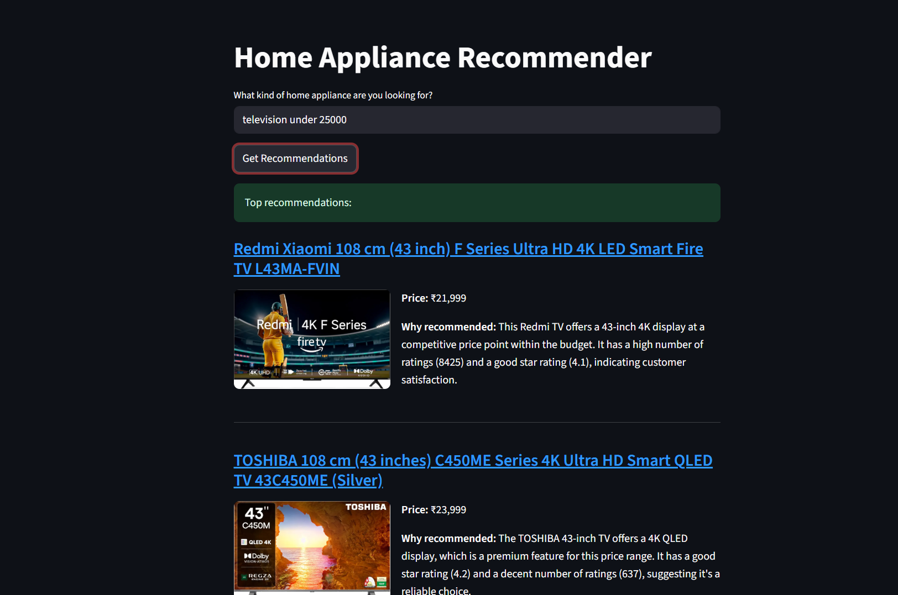
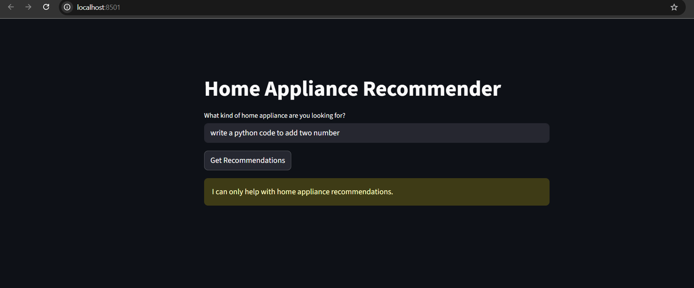

# AI Home Appliance Recommender with LangGraph and Rapid API

This project is an intelligent home appliance recommendation agent built using Python. It leverages the LangGraph framework to create a conditional workflow that classifies user queries, scrapes real-time product data from Amazon, uses a Large Language Model (LLM) to generate expert recommendations, and displays them in a user-friendly web interface created with Streamlit.

## Features

-   **Natural Language Queries**: Simply ask for what you're looking for (e.g., "a quiet dishwasher for a small apartment").
-   **Intelligent Query Classification**: The agent first determines if the query is about home appliances before proceeding.
-   **Real-Time Product Data**: Fetches up-to-date product information, including prices and images, directly from Amazon via an API.
-   **AI-Powered Recommendations**: Uses Google's Gemini to analyze the product list and provide the top 3 recommendations, complete with a reasoning for each choice.
-   **Conditional Workflow**: Built with LangGraph to create a robust, multi-step process that can branch or terminate based on context.
-   **Interactive Web UI**: A clean and simple interface built with Streamlit to display the recommendations attractively.

## How It Works: The LangGraph Agent Workflow

The core of this application is a stateful graph that orchestrates the entire recommendation process, from understanding the user's intent to presenting the final output.

### Visual Workflow



### The Process Steps

1.  **Entry Point (`classify`)**: The user's query enters the graph. The first node uses an LLM to perform a simple classification: is this query about a home appliance? The result is a boolean (`True` or `False`).
2.  **Conditional Routing**: Based on the classification, a router function decides the next step:
    *   **If `relevant` is `False`**: The query is not about home appliances. The graph transitions directly to the `END`, and the application informs the user it can't help.
    *   **If `relevant` is `True`**: The query is valid. The graph proceeds to the next step in the chain: `scrape`.
3.  **Scrape (`scrape`)**: This node calls an external API (the Real-Time Amazon Data API on RapidAPI) to search for products on Amazon that match the user's query. It returns a list of product data.
4.  **Recommend (`recommend`)**: The user's query and the scraped list of products are passed to the LLM. The LLM is prompted to act as an expert, select the top 3 most suitable products, and provide a clear `reasoning` for each selection. The output is parsed into a structured list of `ASIN`s and `reasoning`.
5.  **Format Output (`format_output`)**: This final node takes the structured recommendations from the `recommend` step and merges them with the full product details (title, price, image, link) gathered in the `scrape` step. This creates a user-friendly final list.
6.  **End**: The graph run is complete, and the final, formatted product list is returned to the Streamlit UI for display.

## Demo





## Tech Stack

-   **Graph Orchestration**: LangGraph
-   **LLM Framework**: LangChain
-   **LLM Provider**: Google Gemini (`gemini-2.0-flash-lite`)
-   **Frontend**: Streamlit
-   **External Data**: [Real-Time Amazon Data](https://rapidapi.com/letsscrape/api/real-time-amazon-data) on RapidAPI
-   **Data Validation**: Pydantic
-   **Environment Variables**: `python-dotenv`

## Setup and Installation

Follow these steps to run the application on your local machine.

### 1. Clone the Repository

```bash
git clone https://github.com/your-username/your-repository-name.git
cd your-repository-name
```

### 2. Create a Virtual Environment

It is highly recommended to use a virtual environment to manage project dependencies.

```bash
# For Windows
python -m venv venv
venv\Scripts\activate
```

### 3. Install Dependencies

Install all the required Python packages from a `requirements.txt` file.

```bash
pip install -r requirements.txt
```
### 4. Set Up Your API Keys

This project requires **two** separate API keys to function.

1.  Create a file named `.env` in the root directory of the project.
2.  Add your API keys to the `.env` file in the following format:

    ```env
    GOOGLE_API_KEY="YOUR_GOOGLE_GEMINI_API_KEY_HERE"
    RAPIDAPI_KEY="YOUR_RAPIDAPI_AMAZON_API_KEY_HERE"
    ```
    -   **`GOOGLE_API_KEY`**: Your key for the Google Gemini API.
    -   **`RAPIDAPI_KEY`**: Your key from RapidAPI after subscribing to the Real-Time Amazon Data API.


## How to Run the Application

Once the setup is complete, run the following command in your terminal:

```bash
streamlit run app.py
```

Your web browser will automatically open a new tab with the recommender application.

## 📂 Project Structure

```
.
├── app.py              # Main Streamlit application file for the UI
├── recommender.py      # Contains the LangGraph definition and node logic
├── scraper.py          # Function to call the external Amazon Search API
├── utils.py            # Helper functions for LLM calls (classify, recommend) and data formatting
├── models.py           # Pydantic models for data validation and structure
├── graph.png           # The visual representation of the LangGraph workflow
├── .env                # Stores the API keys (should not be in Git)
└── requirements.txt    # List of Python dependencies
```